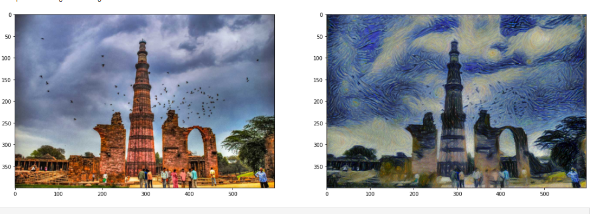

# Style-Transfer
In this notebook, we’ll recreate a style transfer method that is outlined in the paper, Image Style Transfer Using Convolutional Neural Networks, by Gatys in PyTorch. The process is explained in detail in the notebook itself!

## Results 

## References
* https://www.cv-foundation.org/openaccess/content_cvpr_2016/papers/Gatys_Image_Style_Transfer_CVPR_2016_paper.pdf
* https://pytorch.org/hub/pytorch_vision_vgg/

